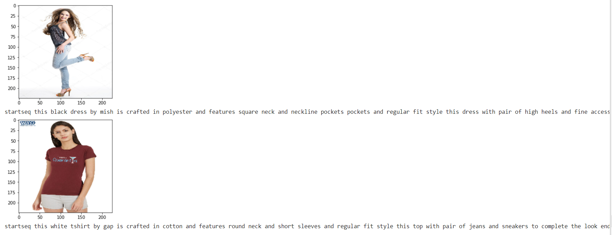
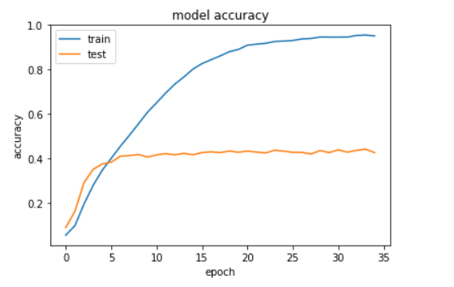

# Image-Captioning
In this project work we will develop and train model which takes any fashion image URL as input and generates an AI based description and evaluate trained model and use it to generate description for entirely new photographs
# Prerequisite
##### tensorflow: 2.4.0
##### keras: 2.4.3

# Steps
1. Images and Dataset-1  
2. Prepare Text Data  
3. Prepare Image Data  
4. Develop Deep Learning Model  
5. Train and Evaluate Model  
6. Generate New Description

## The shared folder contains the following files
##### 1. dataset 1.xlsx :  This is the given dataset excel file.
##### 2. images folder :  This folder contains the provided images for the dataset.
##### 3. Task1.ipynb :  This is the colab notebook   
Can simply run this model using the notebook 

# Result

# Accuracy Plot

# Conclusion
Model is underfit because dataset taken is very less 

# Scope of Improvement
Train on large dataset 
